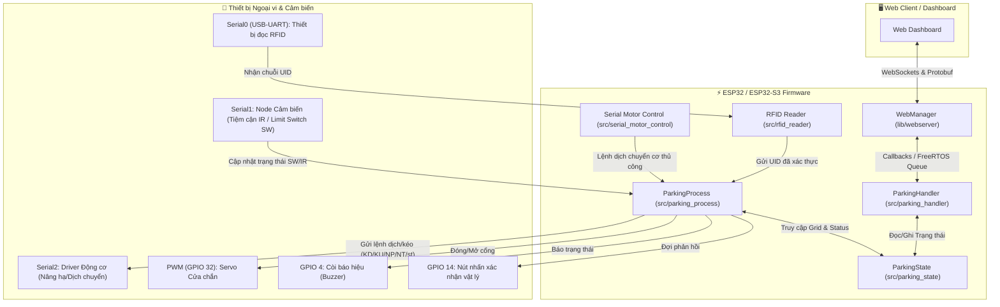
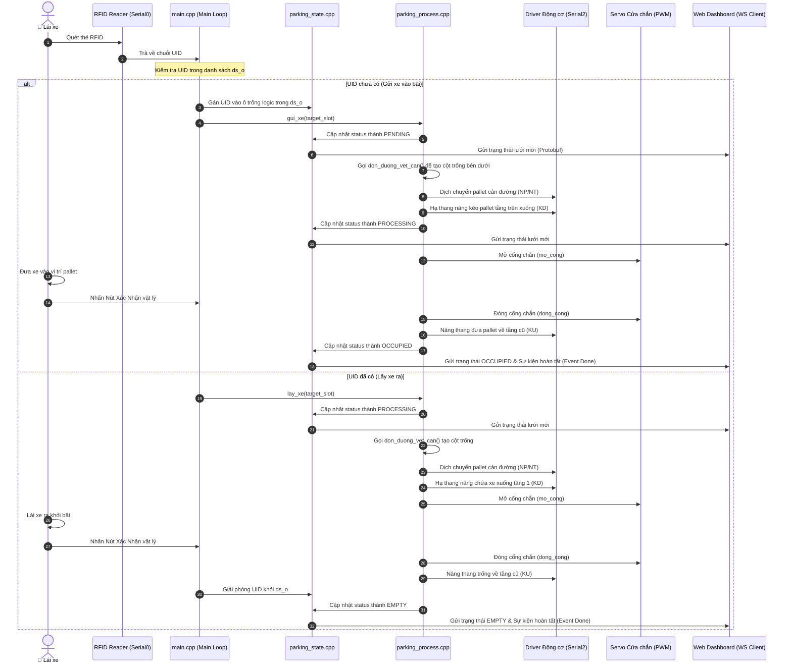

# 🚗 Tài liệu Kiến trúc Hệ thống - ESP32 Smart Parking Dashboard

Tài liệu này mô tả chi tiết kiến trúc phần mềm, luồng xử lý dữ liệu, thiết kế phần cứng, cấu trúc các nhánh phát triển Git, và phân tích các điểm đặc thù/thiếu tiêu chuẩn của dự án **ESP32 Automated Parking Dashboard**.

---

## 📌 1. Tổng quan & Sơ đồ Khối Hệ thống

Hệ thống quản lý và vận hành một bãi đỗ xe tự động dạng lưới gồm **10 ô đỗ logic chia làm 3 tầng** thông qua vi điều khiển ESP32 / ESP32-S3. Thiết bị giao tiếp với người dùng cuối qua trang Web Dashboard thời gian thực sử dụng kết nối WebSockets và định dạng Protobuf (Nanopb), đồng thời vận hành các động cơ và cảm biến phần cứng qua các cổng UART/GPIO.

### 🏢 Cấu trúc cơ học và logic của bãi đỗ xe
* **Hệ cơ học (Grid - 12 ô)**: Được biểu diễn bằng một lưới 3 hàng x 4 cột. Lưới này có các ô trống vật lý để các pallet có thể dịch chuyển ngang, mở đường cho pallet ở tầng trên hạ xuống.
* **Hệ logic (Slots - 10 ô)**: Là 10 vị trí đỗ xe thực tế của khách hàng (Tầng 1: 3 ô, Tầng 2: 3 ô, Tầng 3: 4 ô).

### 🛠️ Sơ đồ khối tương tác giữa các thành phần

---

## 🌿 2. Cấu trúc và Lịch sử Nhánh Git (Gitgraph)

---

## 🔌 3. Cấu hình Phần cứng (Hardware Pinout)

Chi tiết cấu hình chân kết nối của vi điều khiển được định nghĩa tại tệp [hardware.h](src/hardware.h):

* **`PIN_BUZZER` (GPIO 4)**: Còi báo hiệu trạng thái hoạt động (bíp khi quét thẻ thành công hoặc hoàn tất chu kỳ dịch xe).
* **`PIN_NUT_XAC_NHAN` (GPIO 14)**: Nút bấm vật lý dành cho người lái xe nhấn để xác nhận đã đưa xe vào/ra khỏi vị trí nâng hạ trước khi cổng chắn đóng lại.
* **`PIN_SERVO_CONG` (GPIO 32)**: Điều khiển Servo đóng/mở barrier an toàn (không sử dụng trên bản ESP32-S3).
* **UART Interfaces**:
  * **Serial0 (Mặc định)**: Dùng để nạp code, xuất log debug và nhận luồng dữ liệu thô từ đầu đọc RFID (giao thức UART) hoặc nhận lệnh điều khiển động cơ bằng tay.
  * **Serial1 (RX: GPIO 35, TX: -1)**: Nhận phản hồi trạng thái cảm biến tiệm cận hồng ngoại (IR) và công tắc hành trình (SW).
  * **Serial2 (RX: GPIO 16, TX: GPIO 17)**: Gửi lệnh điều khiển và nhận tín hiệu phản hồi từ bộ Driver Động cơ cơ khí.

---

## 📂 4. Chi tiết các Thành phần Phần mềm (Software Components)

### 🚀 4.1. Khởi tạo & Luồng chính ([main.cpp](src/main.cpp))
* **Setup**: Khởi tạo 3 kênh UART (Serial, Serial1, Serial2). Đăng ký các hàm callback lambda để thiết lập liên kết lỏng lẻo (decoupled) giữa `WebManager` và `ParkingHandler`. Định cấu hình kênh PWM cho Servo và cấu hình các chân nút nhấn/buzzer. Cuối cùng, thực hiện căn chỉnh vị trí ban đầu của các pallet.
* **Loop**: 
  1. Gọi hàm loop của `ParkingHandler` và `WebManager` để giải phóng bộ đệm truyền thông.
  2. Đọc trạng thái cảm biến qua [update_sensor](src/parking_process.h#L18).
  3. Quét luồng Serial0 nhận UID thẻ RFID. Nếu phát hiện UID:
     * Nếu UID đã tồn tại trong danh sách đỗ xe `ds_o` → gọi hàm [lay_xe](src/parking_process.h#L24) và xóa UID khỏi slot.
     * Nếu UID mới → tìm slot trống đầu tiên, gán UID và gọi hàm [gui_xe](src/parking_process.h#L23).

### 🖥️ 4.2. Web Server & Captive Portal ([websever.h](lib/webserver/websever.h))
* Được thực thi bởi lớp `WebManager` sử dụng thư viện `ESPAsyncWebServer`.
* Cung cấp **Captive Portal** bằng cách chạy một máy chủ DNS (`DNSServer`) để chặn mọi yêu cầu truy cập và chuyển hướng client về trang dashboard lưu trong bộ nhớ flash của ESP32 (dưới dạng mã HTML/JS nén Gzip tĩnh tại [index.minify.h](lib/webserver/index.minify.h)).
* Cung cấp kênh WebSocket `/ws` để giao tiếp dữ liệu nhị phân Protobuf thời gian thực.

### 📡 4.3. Giao tiếp Protobuf & Quản lý Sự kiện ([parking_handler.h](src/parking_handler.h))
* Lớp `ParkingHandler` đảm nhận việc đóng gói (serialize) và giải nén (deserialize) dữ liệu truyền qua WebSocket dựa trên Nanopb.
* **Thread-Safety**: Vì luồng chạy WebServer (Async TCP thread) và luồng chạy ứng dụng chính (Main thread) hoạt động bất đồng bộ, `ParkingHandler` sử dụng một hàng đợi FreeRTOS (`QueueHandle_t _cmdQueue`) để chuyển dữ liệu từ luồng WebSocket sang Main thread xử lý một cách an toàn, tránh tranh chấp tài nguyên (race conditions).

### 📍 4.4. Quản lý trạng thái đỗ xe ([parking_state.h](src/parking_state.h))
* Lưu trữ mảng `Grid[12]` (vật lý) mô tả vị trí cơ học của các pallet và mảng trạng thái `SlotStatus[10]` cùng mảng `ds_o[10]` biểu diễn xe của khách.
* Hàm [recalcStatus](src/parking_state.h#L31) có nhiệm vụ đồng bộ trạng thái `SlotStatus` thành `EMPTY` hoặc `OCCUPIED` tùy theo việc slot đó có đang chứa mã thẻ RFID nào hay không.
* Hàm [movePalletInGrid](src/parking_state.h#L35) thực hiện thay đổi logic ô trống khi di chuyển một pallet cơ học sang trái hoặc sang phải trong lưới `Grid`.

### ⚙️ 4.5. Điều khiển cơ khí & Kịch bản gửi/lấy xe ([parking_process.h](src/parking_process.h))
* Chứa logic vận hành các động cơ dọc (nâng/hạ pallet xe tầng 2/3) và động cơ ngang (dịch chuyển pallet tầng 1/2 để tạo cột trống).
* Hàm [don_duong_vet_can](src/parking_process.h#L21) thực hiện giải thuật dịch chuyển các pallet cản đường sang các ô trống bên cạnh dựa theo cột đích yêu cầu.
* Hàm `xu_ly_xe_chung` thực hiện toàn bộ quy trình: Dọn đường $\rightarrow$ Hạ thang nâng $\rightarrow$ Mở cổng $\rightarrow$ Chờ xác nhận $\rightarrow$ Đóng cổng $\rightarrow$ Nâng thang về vị trí cũ $\rightarrow$ Cập nhật trạng thái và thông báo kết quả lên Web Dashboard.

---

## 🔄 5. Luồng xử lý chi tiết (Sequence Diagrams)

### Luồng Gửi/Lấy xe bằng thẻ RFID

---

## ⚠️ 6. Phân tích sự đặc thù và các điểm hạn chế (Codebase Review)

Như người dùng đã lưu ý, codebase của dự án được cấu trúc theo lối phi tiêu chuẩn và có một số điểm thiếu tối ưu, rối rắm dưới đây:

> [!WARNING]
> ### 1. Trùng lặp và mâu thuẫn hệ thống định vị (Dual Coordinate Mapping)
> Dự án tồn tại song song hai mô hình định vị không gian:
> * Hệ cơ học `Grid[12]` (mô hình 3x4 bao gồm cả các ô trống kỹ thuật).
> * Hệ logic `ds_o[10]` (mô hình 10 vị trí lưu RFID xe khách).
>
> Việc ánh xạ qua lại giữa hai hệ thống này sử dụng các biểu thức toán học được viết cứng (hardcoded) dựa trên số tầng trong hàm [rowPallet2SlotID](src/parking_state.cpp#L30) (ví dụ: `row == 2 ? indexInRow + 4 : indexInRow + 7`). Cách tiếp cận này khiến hệ thống rất khó mở rộng kích thước bãi xe và dễ phát sinh lỗi lệch chỉ mục (Index Out of Bounds).

> [!IMPORTANT]
> ### 2. Trộn lẫn cơ chế Bất đồng bộ với Chờ đợi đồng bộ (Mixed Async & Blocking Code)
> Web server sử dụng mô hình bất đồng bộ hoàn toàn (`ESPAsyncWebServer`), tuy nhiên luồng điều khiển cơ khí trong [parking_process.cpp](src/parking_process.cpp) lại sử dụng các vòng lặp `while` chờ cảm biến kết hợp hàm `delay` cứng. 
>
> Để khắc phục việc WebServer bị treo trong thời gian chờ motor hoạt động (có thể lên tới hàng chục giây), lập trình viên đã viết hàm [softDelay](src/main.cpp#L25) tự chế để chạy cưỡng bức loop của server bên trong thời gian delay. Đây là giải pháp tạm thời (workaround) và có thể gây xung đột stack hoặc tràn bộ nhớ nếu hàng đợi WebSocket dồn ứ tin nhắn.

> [!NOTE]
> ### 3. Khai báo biến toàn cục thiếu kiểm soát (Tight Coupling / External State dependency)
> Các thực thể dữ liệu quan trọng như mảng `Grid`, `ds_o`, `SlotStatus`, mảng cảm biến `sw` và `cam_bien_vi_tri` được khai báo bằng từ khóa `extern` và cho phép chỉnh sửa tự do từ mọi tệp nguồn trong dự án. Việc thiếu tính đóng gói (encapsulation) làm tăng nguy cơ xảy ra tranh chấp dữ liệu (Race Condition) và khiến cho việc viết unit test độc lập gặp nhiều khó khăn.

---

*Tài liệu được biên soạn dựa trên cấu trúc các tệp tin hiện tại trong không gian làm việc của dự án. (9a1376c1461cfcc4b5a586f73bc242cc7e3c2340)*
