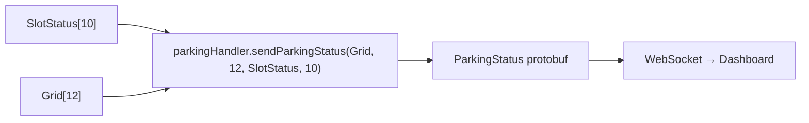

# Phân tích ánh xạ O_Do ↔ SlotStatus ↔ Grid

## 1. Khởi tạo `ds_o[10]` — Logic Controller

Tại [setup()](file:///home/vuquan/dev/esp-parking-dashboard/src/main.cpp#L840-L862):

```cpp
// i=0..2 → Tầng 1, cột 1..3
ds_o[0] = { row=1, col=1 }
ds_o[1] = { row=1, col=2 }
ds_o[2] = { row=1, col=3 }

// i=3..5 → Tầng 2, cột 1..3
ds_o[3] = { row=2, col=1 }
ds_o[4] = { row=2, col=2 }
ds_o[5] = { row=2, col=3 }

// i=6..9 → Tầng 3, cột 1..4
ds_o[6] = { row=3, col=1 }
ds_o[7] = { row=3, col=2 }
ds_o[8] = { row=3, col=3 }
ds_o[9] = { row=3, col=4 }
```

## 2. Hàm `rowPallet2SlotID(row, col)` — Chuyển tọa độ sang Pallet ID

Tại [rowPallet2SlotID()](file:///home/vuquan/dev/esp-parking-dashboard/src/main.cpp#L141-L167):

```
row=3: slotID = col                    → 1, 2, 3, 4
row=2: slotID = col + 4               → 5, 6, 7
row=1: slotID = col + 7               → 8, 9, 10
```

`rowPallet2SlotIndex(row, col) = slotID - 1` (0-based)

## 3. Bảng ánh xạ tổng hợp

| ds_o index | row | col | Pallet ID (1-based) | SlotStatus index (0-based) |    IR Pin     |
| :--------: | :-: | :-: | :-----------------: | :------------------------: | :-----------: |
|     0      |  1  |  1  |        **8**        |           **7**            | IR_T1_C1 (21) |
|     1      |  1  |  2  |        **9**        |           **8**            | IR_T1_C2 (13) |
|     2      |  1  |  3  |       **10**        |           **9**            | IR_T1_C3 (14) |
|     3      |  2  |  1  |        **5**        |           **4**            | IR_T2_C1 (25) |
|     4      |  2  |  2  |        **6**        |           **5**            | IR_T2_C2 (26) |
|     5      |  2  |  3  |        **7**        |           **6**            | IR_T2_C3 (27) |
|     6      |  3  |  1  |        **1**        |           **0**            | IR_T3_C1 (36) |
|     7      |  3  |  2  |        **2**        |           **1**            | IR_T3_C2 (39) |
|     8      |  3  |  3  |        **3**        |           **2**            | IR_T3_C3 (2)  |
|     9      |  3  |  4  |        **4**        |           **3**            | IR_T3_C4 (15) |

> [!IMPORTANT]
> **ds_o index ≠ Pallet ID ≠ SlotStatus index**. Thứ tự ngược nhau:
>
> - `ds_o[0]` (tầng 1) → Pallet ID **8** → `SlotStatus[7]`
> - `ds_o[9]` (tầng 3) → Pallet ID **4** → `SlotStatus[3]`

## 4. Mảng `Grid[12]` — Bản đồ vật lý

```
Grid[12] = { 1, 2, 3, 4,  5, 6, 7, 0,  8, 9, 10, 0 }
```

Biểu diễn dưới dạng lưới 3×4 (row 0 = tầng 3, row 2 = tầng 1):

```
         Col 0    Col 1    Col 2    Col 3
Row 0:   [1]      [2]      [3]      [4]       ← Tầng 3 (4 pallet)
Row 1:   [5]      [6]      [7]      [0]       ← Tầng 2 (3 pallet + 1 trống)
Row 2:   [8]      [9]      [10]     [0]       ← Tầng 1 (3 pallet + 1 trống)
```

> [!NOTE]
> `Grid` dùng **Pallet ID** (1-10), giá trị 0 = ô trống. Vị trí pallet trong grid thay đổi khi `movePalletInGrid()` hoán đổi.

## 5. Mảng `SlotStatus[10]` — Trạng thái từng Pallet

```
SlotStatus[0] → Pallet 1 (T3-C1)
SlotStatus[1] → Pallet 2 (T3-C2)
SlotStatus[2] → Pallet 3 (T3-C3)
SlotStatus[3] → Pallet 4 (T3-C4)
SlotStatus[4] → Pallet 5 (T2-C1)
SlotStatus[5] → Pallet 6 (T2-C2)
SlotStatus[6] → Pallet 7 (T2-C3)
SlotStatus[7] → Pallet 8 (T1-C1)
SlotStatus[8] → Pallet 9 (T1-C2)
SlotStatus[9] → Pallet 10 (T1-C3)
```

## 6. Luồng dữ liệu gửi đi

### `sendCurrentParkingStatus()`



Tại [sendCurrentParkingStatus()](file:///home/vuquan/dev/esp-parking-dashboard/src/main.cpp#L247-L268):

- Gửi `Grid[12]` → `ParkingStatus.pallet_grid` (12 phần tử)
- Gửi `SlotStatus[10]` → `ParkingStatus.slots` (10 phần tử)

### `sendCurrentParkingEvent(pallet_id, event_type, is_done)`

Tại [sendCurrentParkingEvent()](file:///home/vuquan/dev/esp-parking-dashboard/src/main.cpp#L282-L300):

- Validate `pallet_id` ∈ [1..10]
- Gửi `ParkingEvent { event_id, pallet_id, event_type, is_done }`

## 7. Kiểm tra tính chính xác

### ✅ `gui_xe()` — Gửi xe vào

Tại [gui_xe()](file:///home/vuquan/dev/esp-parking-dashboard/src/main.cpp#L645-L725):

| Bước                    | Code                                                           | Đúng?                   |
| ----------------------- | -------------------------------------------------------------- | ----------------------- |
| Tìm ô trống             | `ds_o[i].rfid == "" && IR == HIGH`                             | ✅                      |
| Tính pallet_id          | `rowPallet2SlotID(t, c)`                                       | ✅ Dùng row/col từ ds_o |
| Tính slotIndex          | `rowPallet2SlotIndex(t, c)`                                    | ✅ = pallet_id - 1      |
| Set PENDING             | `SlotStatus[slotIndex] = PENDING`                              | ✅ Index đúng           |
| Send status             | `sendCurrentParkingStatus()`                                   | ✅                      |
| Send event IN (start)   | `sendCurrentParkingEvent(pallet_id, IN, false)`                | ✅                      |
| Set PROCESSING          | `SlotStatus[slotIndex] = PROCESSING`                           | ✅                      |
| Recalculate + send done | `recalcStatus(); sendCurrentParkingEvent(pallet_id, IN, true)` | ✅                      |

### ✅ `lay_xe()` — Lấy xe ra

Tại [lay_xe()](file:///home/vuquan/dev/esp-parking-dashboard/src/main.cpp#L727-L798):

| Bước                    | Code                                                            | Đúng? |
| ----------------------- | --------------------------------------------------------------- | ----- |
| Tính pallet_id          | `rowPallet2SlotID(t, c)` từ `ds_o[target]`                      | ✅    |
| Tính slotIndex          | `rowPallet2SlotIndex(t, c)`                                     | ✅    |
| Set PROCESSING          | `SlotStatus[slotIndex] = PROCESSING`                            | ✅    |
| Send event OUT (start)  | `sendCurrentParkingEvent(pallet_id, OUT, false)`                | ✅    |
| Recalculate + send done | `recalcStatus(); sendCurrentParkingEvent(pallet_id, OUT, true)` | ✅    |

### ✅ `don_duong_vet_can()` — Dọn đường

Tại [don_duong_vet_can()](file:///home/vuquan/dev/esp-parking-dashboard/src/main.cpp#L487-L630):

- Sử dụng `rowPallet2SlotIndex(row, pallet)` cho mỗi pallet cần di chuyển → **đúng**
- Cập nhật `SlotStatus` theo đúng trình tự: PENDING → PROCESSING → UNKNOWN → **đúng**
- `movePalletInGrid()` trong `day_den_sw()` cập nhật `Grid` khi pallet di chuyển → **đúng**
- Gọi `sendCurrentParkingStatus()` sau mỗi bước → **đúng**

### ✅ `day_den_sw()` — Di chuyển pallet ngang

Tại [day_den_sw()](file:///home/vuquan/dev/esp-parking-dashboard/src/main.cpp#L444-L472):

- `movePalletInGrid(target, 1)` cho NP (phải), `2` cho NT (trái) → **đúng**
- `target = rowPallet2SlotID(row, pallet)` → Pallet ID, dùng làm key tra Grid → **đúng**

## 8. Phân tích Protobuf Mapping

Tại [parking_handler.cpp:132-163](file:///home/vuquan/dev/esp-parking-dashboard/src/parking_handler.cpp#L132-L163):

```
ParkingStatus.pallet_grid[i] = Grid[i]      (i = 0..11)
ParkingStatus.slots[i]       = SlotStatus[i] (i = 0..9)
```

Protobuf definition ([parking.proto](file:///home/vuquan/dev/esp-parking-dashboard/proto/parking.proto#L14-L28)):

- `pallet_grid`: `repeated uint32` max_count=12 → Maps Grid position → Pallet ID
- `slots`: `repeated Status` max_count=10 → Maps Pallet ID-1 → Status enum

> [!TIP]
> **Dashboard cần decode theo quy tắc:**
>
> - `pallet_grid[i]` cho biết pallet nào đang ở vị trí grid `i`
> - `slots[pallet_id - 1]` cho biết trạng thái của pallet đó

## 9. Kết luận

### ✅ Ánh xạ chính xác

| Kiểm tra                                            | Kết quả                                  |
| --------------------------------------------------- | ---------------------------------------- |
| `ds_o[i]` → `(row, col)`                            | ✅ Khởi tạo đúng trong `setup()`         |
| `(row, col)` → `pallet_id` via `rowPallet2SlotID()` | ✅ Logic tính toán đúng                  |
| `pallet_id - 1` → `SlotStatus` index                | ✅ Nhất quán                             |
| `Grid[12]` phản ánh vị trí pallet                   | ✅ Cập nhật qua `movePalletInGrid()`     |
| `sendCurrentParkingStatus()` gửi đúng data          | ✅ Gửi cả Grid + SlotStatus              |
| `sendCurrentParkingEvent()` gửi đúng pallet_id      | ✅ Validate [1..10]                      |
| Event IN/OUT flow đúng trình tự                     | ✅ PENDING → PROCESSING → recalcStatus() |

### ⚠️ Lưu ý nhỏ (không phải bug)

> [!NOTE]
> **IR sensor trong `loop()`** (dòng 886-911): Khi trạng thái IR thay đổi, chỉ in Serial log mà **không gửi event/status qua WebSocket**. Đây có thể là intentional (chỉ log debug), nhưng nếu muốn dashboard cập nhật real-time khi IR thay đổi, cần thêm `sendCurrentParkingStatus()` tại đây.

> [!NOTE]
> **`recalcStatus()` được sử dụng để cập nhật lại `SlotStatus`**: Sau khi `gui_xe()`/`lay_xe()` hoàn tất, hàm này đặt `SlotStatus` dựa trên `ds_o[i].rfid` và gửi lại trạng thái chính xác.
