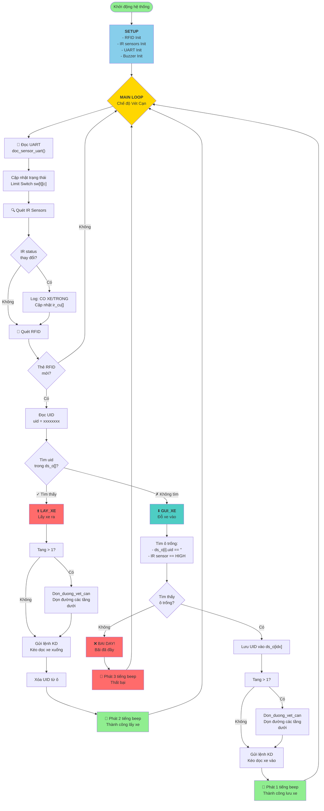
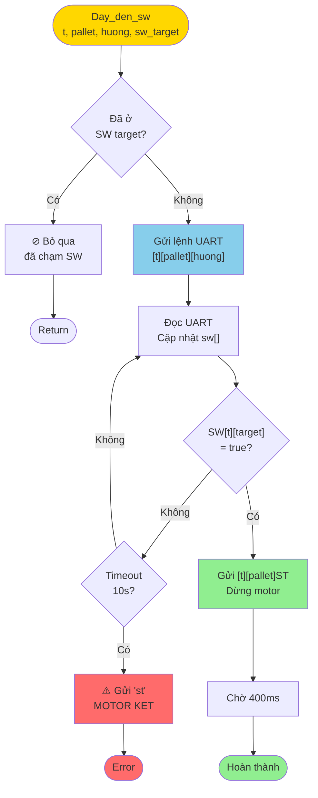

```mermaid
flowchart TD
    Start([Khởi động hệ thống]) --> Init["<b>SETUP</b><br/>- RFID Init<br/>- IR sensors Init<br/>- UART Init<br/>- Buzzer Init"]
    Init --> Loop{"<b>MAIN LOOP</b><br/>Chế độ Vét Cạn"}

    Loop --> ReadUART["📡 Đọc UART<br/>doc_sensor_uart()"]
    ReadUART --> UpdateSW["Cập nhật trạng thái<br/>Limit Switch sw[t][c]"]

    UpdateSW --> ScanIR["🔍 Quét IR Sensors"]
    ScanIR --> CheckIRChange{"IR status<br/>thay đổi?"}
    CheckIRChange -->|Có| LogIR["Log: CO XE/TRONG<br/>Cập nhật ir_cu[]"]
    CheckIRChange -->|Không| ScanRFID["📱 Quét RFID"]
    LogIR --> ScanRFID

    ScanRFID --> CardPresent{"Thẻ RFID<br/>mới?"}
    CardPresent -->|Không| Loop
    CardPresent -->|Có| ReadUID["Đọc UID<br/>uid = xxxxxxxx"]

    ReadUID --> FindTag{"Tìm uid<br/>trong ds_o[]?"}

    FindTag -->|✓ Tìm thấy| LayXe["⬆️ <b>LAY_XE</b><br/>Lấy xe ra"]
    FindTag -->|✗ Không tìm| GuiXe["⬇️ <b>GUI_XE</b><br/>Đỗ xe vào"]

    LayXe --> CheckTang1["Tang > 1?"]
    CheckTang1 -->|Có| ClearPath1["Don_duong_vet_can<br/>Dọn đường các tầng<br/>dưới"]
    CheckTang1 -->|Không| PullCar["Gửi lệnh KD<br/>Kéo dọc xe xuống"]
    ClearPath1 --> PullCar
    PullCar --> ClearUID["Xóa UID từ ô"]
    ClearUID --> Beep2["🔔 Phát 2 tiếng beep<br/>Thành công lấy xe"]
    Beep2 --> Loop

    GuiXe --> FindEmpty["Tìm ô trống:<br/>- ds_o[i].uid == ''<br/>- IR sensor == HIGH"]
    FindEmpty --> SpotFound{"Tìm thấy<br/>ô trống?"}

    SpotFound -->|Không| Full["❌ BAI DAY!<br/>Bãi đã đầy"]
    Full --> Beep3["🔔 Phát 3 tiếng beep<br/>Thất bại"]
    Beep3 --> Loop

    SpotFound -->|Có| SaveUID["Lưu UID vào ds_o[idx]"]
    SaveUID --> CheckTang2["Tang > 1?"]
    CheckTang2 -->|Có| ClearPath2["Don_duong_vet_can<br/>Dọn đường các tầng<br/>dưới"]
    CheckTang2 -->|Không| InsertCar["Gửi lệnh KD<br/>Kéo dọc xe vào"]
    ClearPath2 --> InsertCar
    InsertCar --> Beep1["🔔 Phát 1 tiếng beep<br/>Thành công lưu xe"]
    Beep1 --> Loop

    style Start fill:#90EE90
    style Init fill:#87CEEB
    style Loop fill:#FFD700
    style LayXe fill:#FF6B6B
    style GuiXe fill:#4ECDC4
    style Full fill:#FF6B6B
    style Beep2 fill:#90EE90
    style Beep1 fill:#90EE90
    style Beep3 fill:#FF6B6B

```

```mermaid

flowchart TD
    Start([Day_den_sw<br/>t, pallet, huong, sw_target]) --> CheckSW{"Đã ở<br/>SW target?"}
    CheckSW -->|Có| Skip["⊘ Bỏ qua<br/>đã chạm SW"]
    Skip --> End1([Return])

    CheckSW -->|Không| SendCmd["Gửi lệnh UART<br/>[t][pallet][huong]"]
    SendCmd --> ReadUART["Đọc UART<br/>Cập nhật sw[]"]

    ReadUART --> WaitLoop{"SW[t][target]<br/>= true?"}
    WaitLoop -->|Không| TimeCheck{"Timeout<br/>10s?"}
    TimeCheck -->|Không| ReadUART
    TimeCheck -->|Có| StopEM["⚠️ Gửi 'st'<br/>MOTOR KET"]
    StopEM --> End2([Error])

    WaitLoop -->|Có| StopMotor["Gửi [t][pallet]ST<br/>Dừng motor"]
    StopMotor --> Wait["Chờ 400ms"]
    Wait --> End3([Hoàn thành])

    style Start fill:#FFD700
    style SendCmd fill:#87CEEB
    style StopMotor fill:#90EE90
    style StopEM fill:#FF6B6B
    style End3 fill:#90EE90
    style End2 fill:#FF6B6B
```

