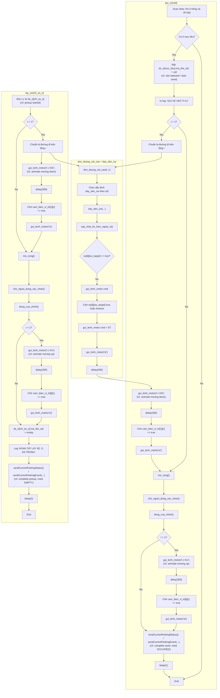

```mermaid
flowchart TD
subgraph GUI_XE["gui_xe(uid)"]
A1["Scan slots: tìm ô trống và IR thật"]
A2{"Có ô mục tiêu?"}
A3["Đặt ds_o[muc_tieu].ma_the_uid = uid\n(UI: slot selected / start send)"]
A4["In log: 'GUI XE VAO Tt-Cc'"]
A5{"t > 1?"}
A6["Chuẩn bị đường đi trên tầng i"]
A7["gui_lenh_motor('t c KD')\n(UI: animate moving down)"]
A8["delay(300)"]
A9["Chờ cam_bien_vi_tri[1][c] == true"]
A10["gui_lenh_motor('st')"]
A11["mo_cong()"]
A12["cho_nguoi_dung_xac_nhan()"]
A13["dong_cua_chinh()"]
A14{"t > 1?"}
A15["gui_lenh_motor('t c KU')\n(UI: animate moving up)"]
A16["delay(300)"]
A17["Chờ cam_bien_vi_tri[t][c] == true"]
A18["gui_lenh_motor('st')"]
A19["sendCurrentParkingStatus() / sendCurrentParkingEvent(...)\n(UI: complete send, mark OCCUPIED)"]
A20["beep(1)"]
A21["End"]
end

subgraph LAY_XE["lay_xe(chi_so_o)"]
B1["Đọc t,c từ ds_o[chi_so_o]\n(UI: pickup started)"]
B2{"t > 1?"}
B3["Chuẩn bị đường đi trên tầng i"]
B4["gui_lenh_motor('t c KD')\n(UI: animate moving down)"]
B5["delay(300)"]
B6["Chờ cam_bien_vi_tri[1][c] == true"]
B7["gui_lenh_motor('st')"]
B8["mo_cong()"]
B9["cho_nguoi_dung_xac_nhan()"]
B10["dong_cua_chinh()"]
B11{"t > 1?"}
B12["gui_lenh_motor('t c KU')\n(UI: animate moving up)"]
B13["delay(300)"]
B14["Chờ cam_bien_vi_tri[t][c] == true"]
B15["gui_lenh_motor('st')"]
B16["ds_o[chi_so_o].ma_the_uid = empty"]
B17["Log 'HOAN TAT LAY XE. O DA TRONG.'"]
B18["sendCurrentParkingStatus() / sendCurrentParkingEvent(...)\n(UI: complete pickup, mark EMPTY)"]
B19["beep(2)"]
B20["End"]
end

subgraph PATH["don_duong_vet_can + day_den_sw"]
C1["don_duong_vet_can(t, c)"]
C2["Chọn dãy lệnh day_den_sw theo cột"]
C3["day_den_sw(...)"]
C4["cap_nhat_tin_hieu_ngoai_vi()"]
C5{"sw[t][sw_target] == true?"}
C6["gui_lenh_motor cmd"]
C7["Chờ sw[t][sw_target] true hoặc timeout"]
C8["gui_lenh_motor cmd + ST"]
C9["gui_lenh_motor('st')"]
C10["delay(400)"]
end

    A1 --> A2
    A2 -- No --> A21
    A2 -- Yes --> A3
    A3 --> A4
    A4 --> A5
    A5 -- Yes --> A6
    A6 --> C1
    C1 --> C2
    C2 --> C3
    C3 --> C4
    C4 --> C5
    C5 -- No --> C6
    C6 --> C7
    C7 --> C8
    C8 --> C9
    C9 --> C10
    C10 --> A7
    A5 -- No --> A11
    A7 --> A8
    A8 --> A9
    A9 --> A10
    A10 --> A11
    A11 --> A12
    A12 --> A13
    A13 --> A14
    A14 -- Yes --> A15
    A15 --> A16
    A16 --> A17
    A17 --> A18
    A18 --> A19
    A14 -- No --> A19
    A19 --> A20
    A20 --> A21

    B1 --> B2
    B2 -- Yes --> B3
    B3 --> C1
    B3 --> B4
    B4 --> B5
    B5 --> B6
    B6 --> B7
    B7 --> B8
    B8 --> B9
    B9 --> B10
    B10 --> B11
    B11 -- Yes --> B12
    B12 --> B13
    B13 --> B14
    B14 --> B15
    B15 --> B16
    B16 --> B17
    B17 --> B18
    B18 --> B19
    B19 --> B20
    B2 -- No --> B8
    B11 -- No --> B16
```
